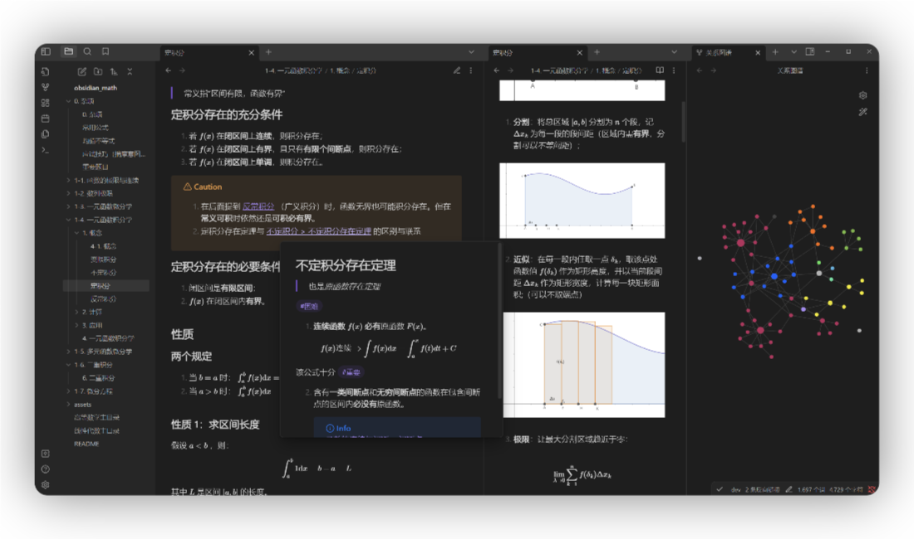
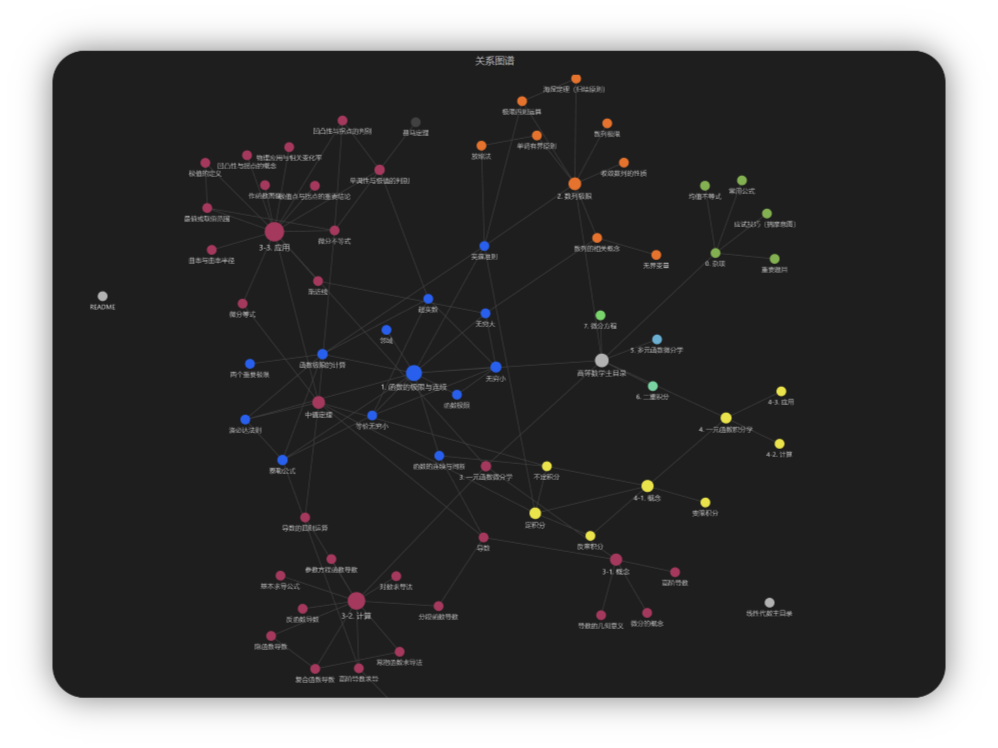
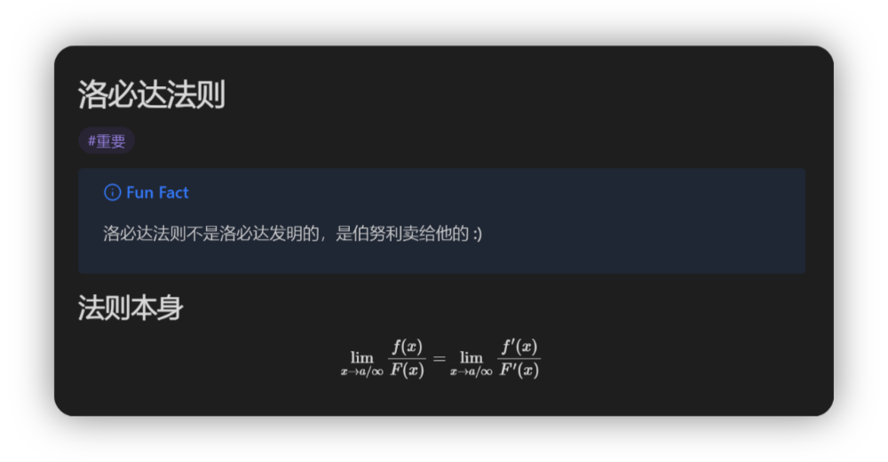
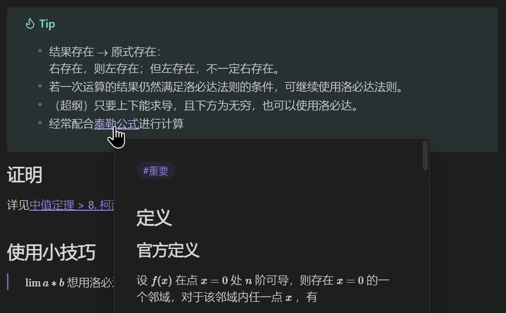

## 考研数学2 Obsidian 笔记本

参考资料：2025张宇基础30讲。**持续更新中。**

相关仓库：[Obsidian C语言考研复习笔记](https://github.com/BlandAlpha/obsidian_c)

发布页面：[Canis的考研数学2笔记](https://publish.obsidian.md/gee-math-2)



### 复习进度

- [ ] 本周目标：一元函数积分学/一元函数积分学的计算（尽量开头）

```
当前章节：高等数学/第8讲/一元函数积分学/概念与性质/变限积分
高等数学总进度：51.03% [##########----------]
线性代数总进度：0.00% [--------------------]
```

> 每周至少完成8%的复习内容，也就是12页。

### 更新说明

- 本笔记已于`2024年5月13日`正式恢复更新。由于个人原因，编写平台将从iPad更改为**Windows**，并将引入**更多插件**以加速工作流。
- 本人有可能会将`877: C语言程序设计与数据库`的学习笔记使用Obsidian进行记录，届时也将发布仓库。
- 本笔记仓库目录结构在2024年4月10日进行了重大更新。使用Github查看的朋友可能会对其中部分md文档较为困惑，但其中大部分均为目录文件，包含了该文件夹下的其他笔记的列表，便于生成更加直观可控的图谱。

---

### 关于本仓库

#### 博客贴文介绍版

[宝宝也能看懂的考研数学笔记 - CanisAlpha](https://blandalpha.github.io/posts/math4baby_project/)

#### README版

本仓库是基于Obsidian的markdown笔记，前期完全在iPad上完成编写与提交。

> 如果你也想使用iPad进行Git提交，请参考这篇教程：[42号笔记：iOS上使用iSH的git同步Obsidian](https://zhuanlan.zhihu.com/p/565028534)

本仓库理论上说可以被任何markdown阅读器打开；但Obsidian可以使用**标签**、**内部链接跳转**和**知识图谱**功能，可以渲染**CallOut块**，获得最完整的体验。

#### 使用插件列表

1. Completr
2. Git
3. Quick Latex

### 功能一览

#### 1. 关系图谱



#### 2. 标签、公式渲染、CallOut渲染



#### 3. 快速链接



### 如何使用

本地使用只需下载本仓库并使用Obsidian打开即可。

#### Git 快捷键

1. Commit all: `Alt + C`
2. Pull: `Ctrl + Shift + -`
3. Push: `Ctrl + Shift + +`

> 你可以在设置中更改自己的快捷键

### 注意事项

1. 为督促学习，每次学习后我将进行一次提交，提交备注是当前日期。若仓库进行了重大变更等，会在提交中进行额外说明。
2. 现在使用`git`插件将会每15分钟提交一次至 `dev` 分支进行备份，每天的学习完成后我会将其手动合并至 `master` 分支。
3. 为了保证内部链接的简洁性，md文件名不包含任何排序与编码。正确浏览顺序请参考目录文件。

### 鸣谢

- 张宇老师的课程，特别是超实数部分的补充，让我有了更深刻的理解。
- YouTube上免费上传张宇老师课程的博主们，让我的网课体验变得更加舒适。
> 注：本人已经购买该课程的正版书籍以及网课内容，如有能力请支持正版。
- [葡萄熟了](https://github.com/SuperGrapee)，他的陪伴让我枯燥的学习变得有趣。也许你会对他的[个人主页](https://supergrapee.github.io/)感兴趣。
