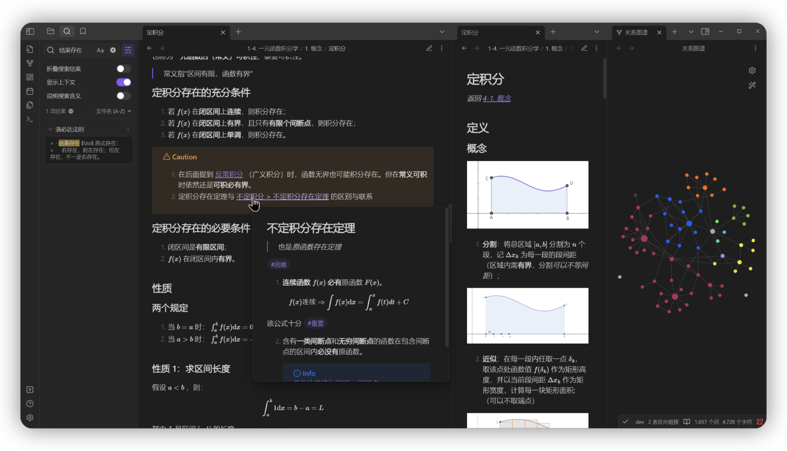
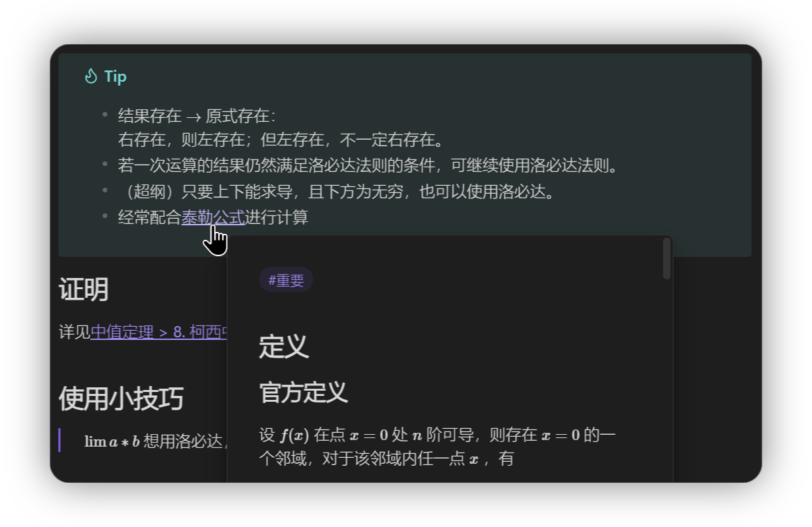

## 考研数学2 Obsidian 笔记本

> [!NOTE]
> 本项目遵循 `GPL-3.0` 协议开源。任何衍生项目**必须**遵守相同协议进行开源。

参考资料：2025张宇基础30讲。**持续更新中。**

在线浏览：[Canis的考研数学2笔记](https://publish.obsidian.md/gee-math-2)



### 复习进度

- [ ] 本周目标：线性代数/第四讲：线性方程组

```
当前章节：线性代数/第四讲：线性方程组/非齐次线性方程组
高等数学总进度：100.0% [####################]
线性代数总进度：55.70% [###########---------]
```

### 更新说明

- **在线浏览请前往 [网页版](https://publish.obsidian.md/gee-math-2) **。本网站将在 `2025年06月19日` 到期。
- 由于个人原因，编写平台将从iPad更改为**Windows**，并将引入**更多插件**以加速工作流。

---

### 关于本仓库

#### 博客贴文介绍版

[宝宝也能看懂的考研数学笔记 - CanisAlpha](https://blandalpha.github.io/posts/math4baby_project/)

#### README版

本仓库是基于Obsidian的markdown笔记，前期完全在iPad上完成编写与提交。

> 如果你也想使用iPad进行Git提交，请参考这篇教程：[42号笔记：iOS上使用iSH的git同步Obsidian](https://zhuanlan.zhihu.com/p/565028534)

本仓库理论上说可以被任何markdown阅读器打开；但Obsidian可以使用**标签**、**内部链接跳转**和**知识图谱**功能，可以渲染**CallOut块**，获得最完整的体验。

#### 使用第三方插件列表

1. Completr
2. Git
3. Quick Latex

### 功能一览

#### 1. 关系图谱


#### 2. 标签、公式渲染、CallOut渲染


#### 3. 快速链接



### 如何使用

本地使用只需下载本仓库并使用Obsidian打开即可。

#### Git 快捷键

1. Commit all: `Alt + C`
2. Pull: `Ctrl + Shift + -`
3. Push: `Ctrl + Shift + +`

你可以在设置中更改自己的快捷键。

### 注意事项

1. 为督促学习，每次学习后我将进行一次提交，提交备注是当前日期。若仓库进行了重大变更等，会在提交中进行额外说明。
2. 为了保证内部链接的简洁性，正文的文件名**不包含**任何排序与编码。正确浏览顺序请参考目录文件。

### 支持本项目

由于数学笔记的特殊性，免费的网站发布方法无法做到 100% 的功能覆盖（完美的公式渲染等），因此只能选择较为昂贵的官方发布。

如果你喜欢我的笔记，或者在线浏览笔记对你有一定的帮助，欢迎随意打赏。你的支持是本项目继续的动力。


   
> *有朋自远方来，不亦乐乎？*

### 鸣谢

> [!NOTE] 
> 本人已经购买该课程的正版书籍以及网课内容，如有能力请支持正版。

- 张宇老师的课程，特别是超实数部分的补充，让我有了更深刻的理解。
- YouTube上免费上传课程的博主们，让我的网课体验变得更加舒适。
- [葡萄熟了](https://github.com/SuperGrapee)，他的陪伴让我枯燥的学习变得有趣。也许你会对他的[个人主页](https://supergrapee.github.io/)感兴趣。